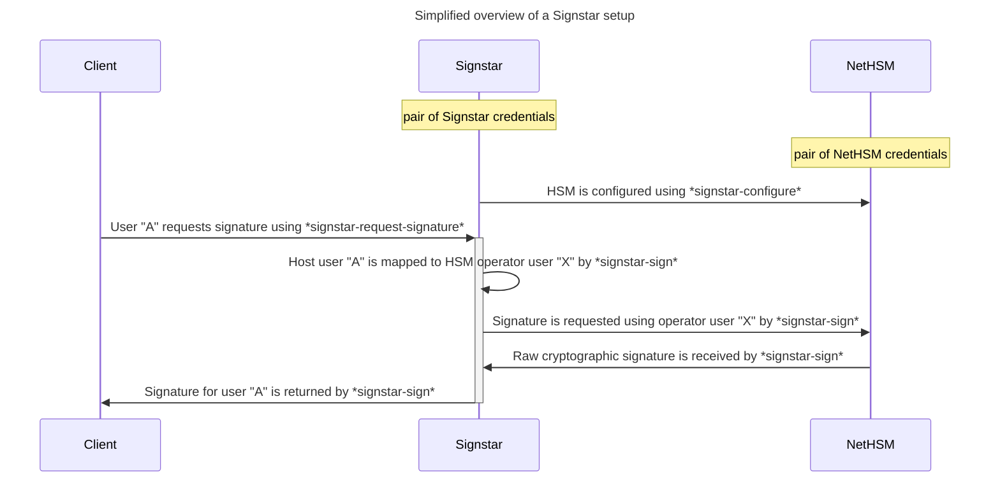

# Signstar

This project provides tools and documentation for running a generic signing enclave with the help of one or more [Nitrokey NetHSM] devices.

Raw cryptographic signatures and [OpenPGP data signatures] are supported.

## Components

Signstar consists of several loosely coupled components, some of which are used in conjunction with one another.

- [nethsm]: A library to provide interaction with the [Nitrokey NetHSM] to applications
- [nethsm-backup]: A library to parse, decrypt, validate and browse [NetHSM backups]
- [nethsm-cli]: A dedicated commandline interface to the [Nitrokey NetHSM], akin to Nitrokey's [pynitrokey], useful for general purpose, interactive use of the HSM
- [nethsm-config]: A library for working with application configuration files for [Nitrokey NetHSM] devices
- [signstar-common]: Shared components and data types for Signstar tools and libraries
- [signstar-config]: Configuration file handling for Signstar hosts
- [signstar-configure-build]: A commandline interface for the configuration of Signstar system during build-time
- *signstar-configure*: An executable, that allows non-interactive configuration of a [Nitrokey NetHSM] based on a configuration ([#48])
- [signstar-crypto]: Common types and functionality for cryptography in Signstar
- [signstar-request-signature]: An executable, run on a client host, that prepares data to be signed and retrieves a signature for it from a Signstar setup
- [signstar-sign]: An executable, that allows signing of messages with the help of a [Nitrokey NetHSM], based on a configuration

## Requirements

A Signstar setup requires a [TPM-2.0]-enabled host, allowing to run [SignstarOS] which provides a read-only root filesystem and an encrypted `/var` partition for its state.
This signing service host is connected to one or more [Nitrokey NetHSM] devices over an otherwise secluded network and exposes *signstar-sign* to clients of the signing service.

Clients use *signstar-request-signature* to connect to a Signstar setup and retrieve a signature for a provided payload.

Further details on the setup, as well as the threat model that the setup operates under can be found in the [design documentation].

## Packaging

The `justfile` contains recipes for generating integration useful for packaging:

- `just generate shell_completions nethsm-cli` generates shell completions for [nethsm-cli] to `$CARGO_TARGET_DIR/output/shell_completions/` (or to `$PWD/output/shell_completions/` if `$CARGO_TARGET_DIR` is unset)
- `just generate manpages nethsm-cli` generates man pages for [nethsm-cli] to`$CARGO_TARGET_DIR/output/manpages/` (or to `$PWD/output/manpages/` if `$CARGO_TARGET_DIR` is unset)

The target directory is created automatically.

## Releases

Releases of [components] are created by the developers of this project.

[OpenPGP certificates] with the following [OpenPGP fingerprints] can be used to verify signed tags:

- [`991F6E3F0765CF6295888586139B09DA5BF0D338`] ([David Runge] &lt;<dvzrv@archlinux.org>&gt;)
- [`653909A2F0E37C106F5FAF546C8857E0D8E8F074`] ([Wiktor Kwapisiewicz] &lt;<wiktor@archlinux.org>&gt;)

Some of the above are part of [archlinux-keyring] and certified by at least three [main signing keys] of the distribution.
All certificate are cross-signed and can be retrieved from [OpenPGP keyservers].

## Contributing

Please refer to the [contributing guidelines] to learn how to contribute to this project.

## License

This project may be used under the terms of the [Apache-2.0] or [MIT] license.

Changes to this project - unless stated otherwise - automatically fall under the terms of both of the aforementioned licenses.

[#48]: https://gitlab.archlinux.org/archlinux/signstar/-/issues/48
[Apache-2.0]: https://www.apache.org/licenses/LICENSE-2.0
[David Runge]: https://archlinux.org/people/developers/#dvzrv
[MIT]: https://opensource.org/licenses/MIT
[NetHSM backups]: https://docs.nitrokey.com/nethsm/administration#backup
[Nitrokey NetHSM]: https://www.nitrokey.com/products/nethsm
[OpenPGP certificates]: https://openpgp.dev/book/certificates.html
[OpenPGP data signatures]: https://openpgp.dev/book/signing_data.html
[OpenPGP fingerprints]: https://openpgp.dev/book/certificates.html#fingerprint
[OpenPGP keyservers]: https://wiki.archlinux.org/title/OpenPGP#Keyserver
[SignstarOS]: resources/mkosi/signstar/
[TPM-2.0]: https://en.wikipedia.org/wiki/Trusted_Platform_Module
[Wiktor Kwapisiewicz]: https://archlinux.org/people/support-staff/#wiktor
[`653909A2F0E37C106F5FAF546C8857E0D8E8F074`]: https://pgpkeys.eu/pks/lookup?search=653909A2F0E37C106F5FAF546C8857E0D8E8F074&fingerprint=on&op=index
[`991F6E3F0765CF6295888586139B09DA5BF0D338`]: https://pgpkeys.eu/pks/lookup?search=991F6E3F0765CF6295888586139B09DA5BF0D338&fingerprint=on&op=index
[archlinux-keyring]: https://gitlab.archlinux.org/archlinux/archlinux-keyring
[components]: #components
[contributing guidelines]: CONTRIBUTING.md
[design documentation]: resources/docs/design.md
[main signing keys]: https://archlinux.org/master-keys/
[nethsm-backup]: nethsm-backup/
[nethsm-cli]: nethsm-cli/
[nethsm-config]: nethsm-config/
[nethsm]: nethsm/
[pynitrokey]: https://github.com/Nitrokey/pynitrokey
[signstar-common]: signstar-common/
[signstar-config]: signstar-config/
[signstar-configure-build]: signstar-configure-build/
[signstar-crypto]: signstar-crypto/
[signstar-request-signature]: signstar-request-signature/
[signstar-sign]: signstar-sign/
