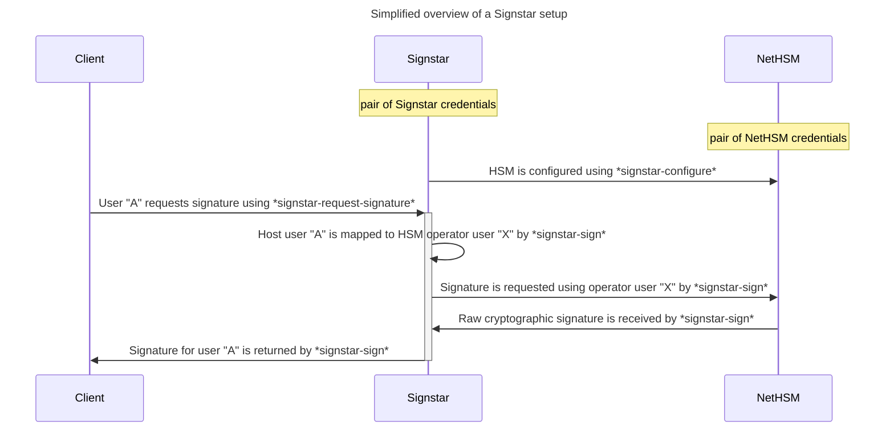

# Signstar

This project provides tools and documentation for running a generic signing enclave with the help of one or more [Nitrokey NetHSM] devices.

Raw cryptographic signatures and [OpenPGP data signatures] are supported.

## Components

Signstar consists of several loosely coupled components, some of which are used in conjunction with one another.

- [nethsm]: A library to provide interaction with the [Nitrokey NetHSM] to applications
- [nethsm-cli]: A dedicated commandline interface to the [Nitrokey NetHSM], akin to Nitrokey's [pynitrokey], useful for general purpose, interactive use of the HSM
- [signstar-configure-build]: A commandline interface for the configuration of Signstar system during build-time
- *signstar-sign*: An executable, that allows signing of messages with the help of a [Nitrokey NetHSM], based on a configuration ([#34])
- *signstar-configure*: An executable, that allows non-interactive configuration of a [Nitrokey NetHSM] based on a configuration ([#48])
- *signstar-request-signature*: An executable, run on a client host, that prepares data to be signed and retrieves a signature for it from a Signstar setup ([#49])

## Requirements

A Signstar setup requires a [TPM-2.0]-enabled host, allowing to run [SignstarOS] which provides a read-only root filesystem and an encrypted `/var` partition for its state.
This signing service host is connected to one or more [Nitrokey NetHSM] devices over an otherwise secluded network and exposes *signstar-sign* to clients of the signing service.

Clients use *signstar-request-signature* to connect to a Signstar setup and retrieve a signature for a provided payload.

Further details on the setup, as well as the threat model that the setup operates under can be found in the [design documentation].

## Packaging

The `justfile` contains recipes for generating integration useful for packaging:

- `just generate shell_completions nethsm-cli` generates shell completions for [nethsm-cli] to `$CARGO_TARGET_DIR/output/shell_completions/` (or to `$PWD/output/shell_completions/` if `$CARGO_TARGET_DIR` is unset)
- `just generate manpages nethsm-cli` generates man pages for [nethsm-cli] to`$CARGO_TARGET_DIR/output/manpages/` (or to `$PWD/output/manpages/` if `$CARGO_TARGET_DIR` is unset)

The target directory is created automatically.

## Contributing

Please refer to the [contributing guidelines] to learn how to contribute to this project.

## License

This project may be used under the terms of the [Apache-2.0] or [MIT] license.

Changes to this project - unless stated otherwise - automatically fall under the terms of both of the aforementioned licenses.

[Apache-2.0]: https://www.apache.org/licenses/LICENSE-2.0
[MIT]: https://opensource.org/licenses/MIT
[Nitrokey NetHSM]: https://www.nitrokey.com/products/nethsm
[OpenPGP data signatures]: https://openpgp.dev/book/signing_data.html
[SignstarOS]: resources/mkosi/signstar/README.md
[TPM-2.0]: https://en.wikipedia.org/wiki/Trusted_Platform_Module
[design documentation]: resources/docs/design.md
[contributing guidelines]: CONTRIBUTING.md
[nethsm]: nethsm/
[nethsm-cli]: nethsm-cli/
[pynitrokey]: https://github.com/Nitrokey/pynitrokey
[signstar-configure-build]: signstar-configure-build/
[#34]: https://gitlab.archlinux.org/archlinux/signstar/-/issues/34
[#48]: https://gitlab.archlinux.org/archlinux/signstar/-/issues/48
[#49]: https://gitlab.archlinux.org/archlinux/signstar/-/issues/49
