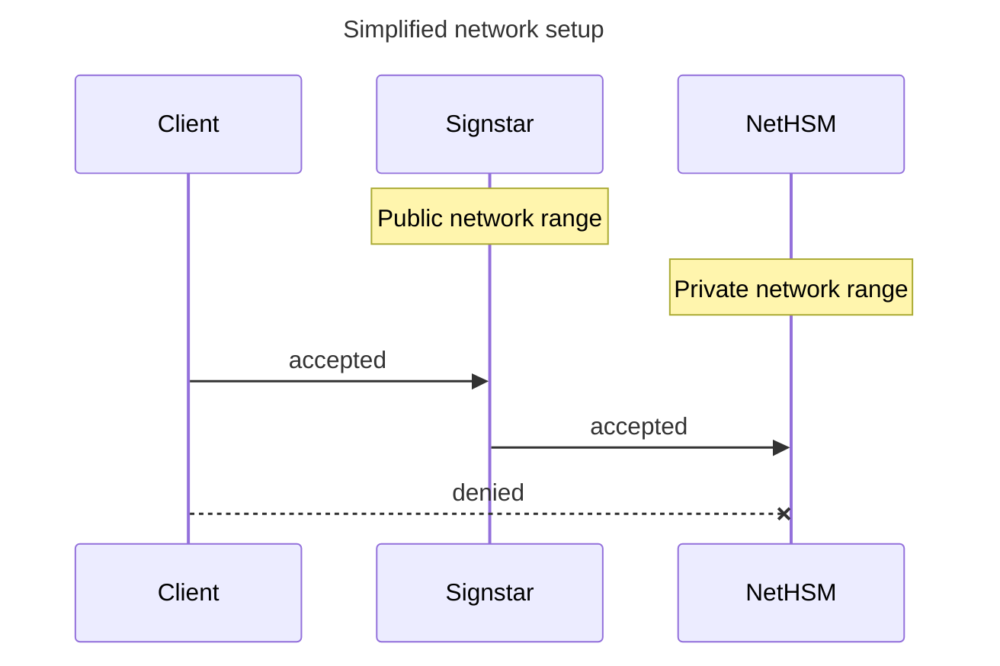
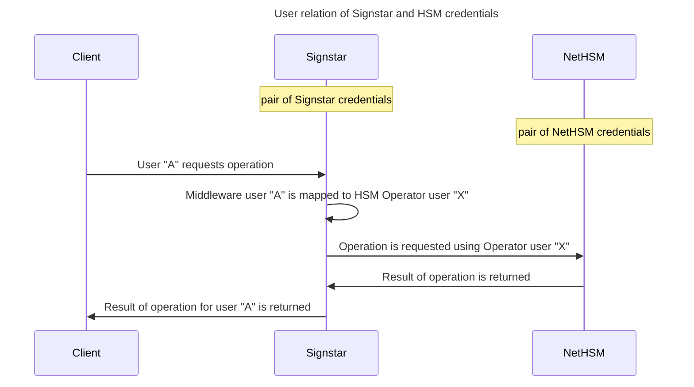
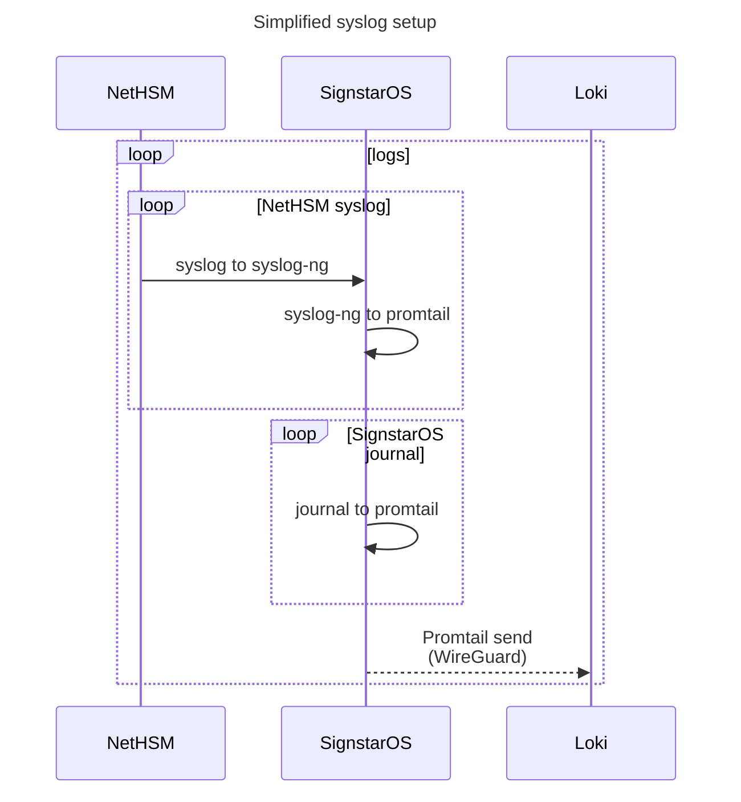
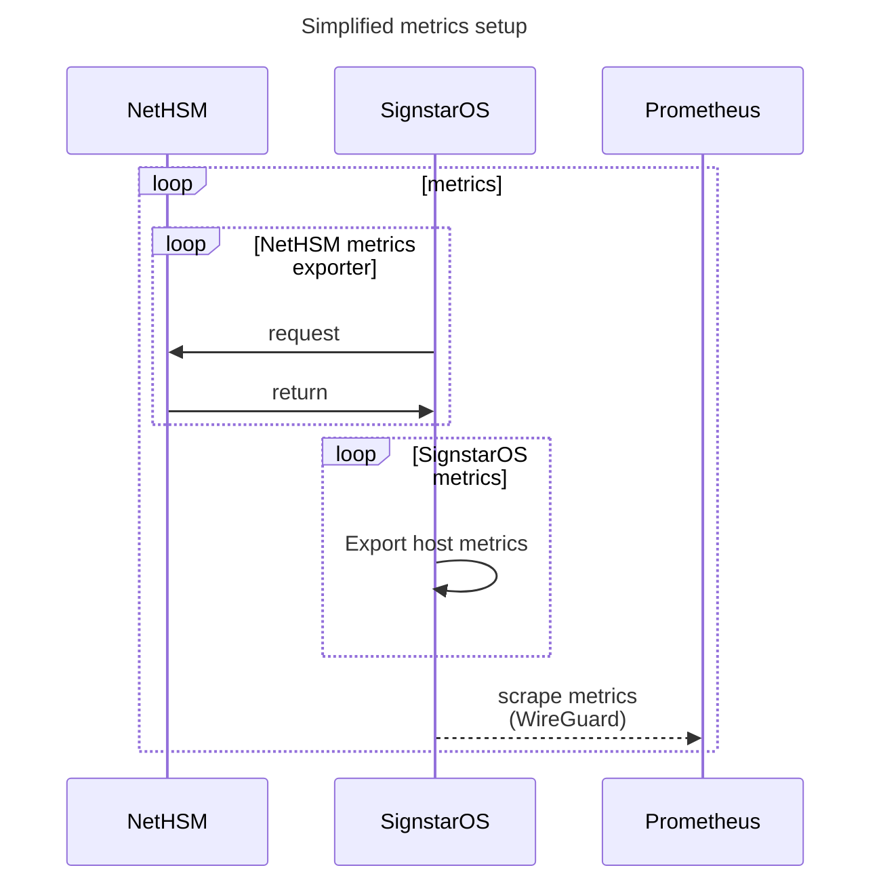
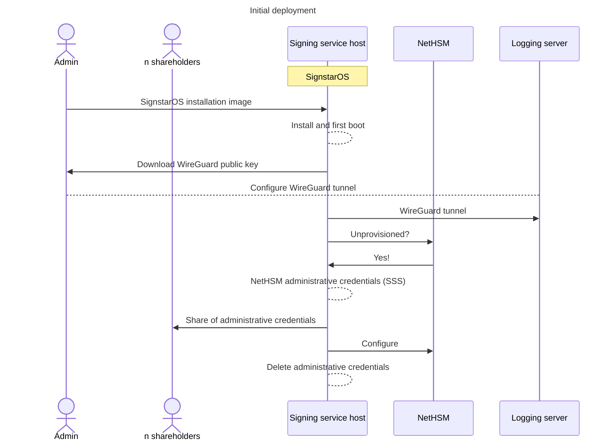
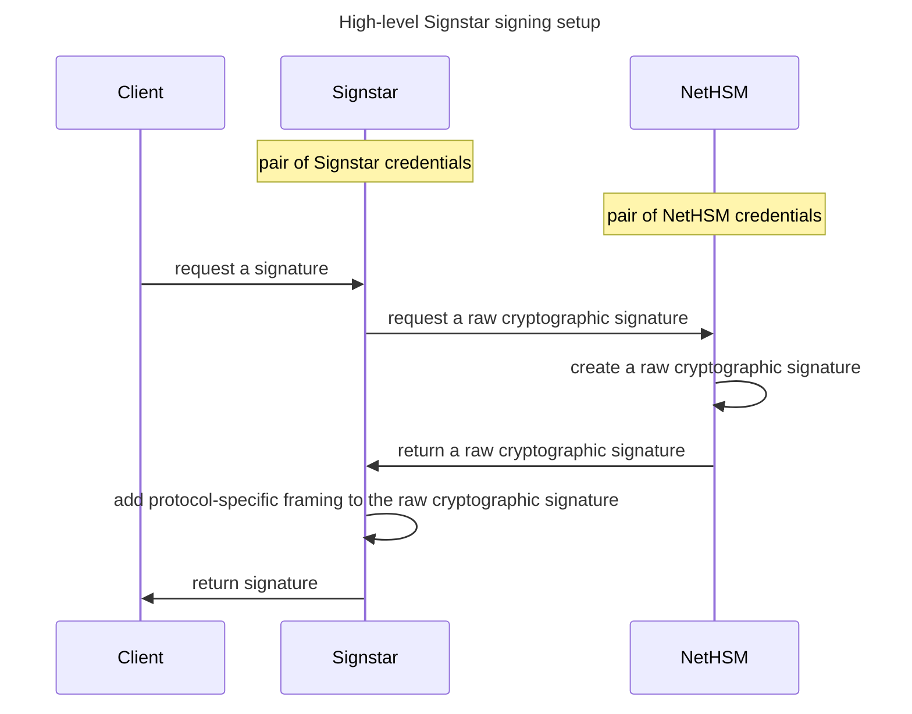
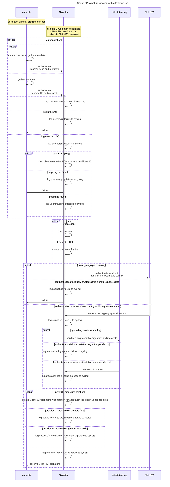
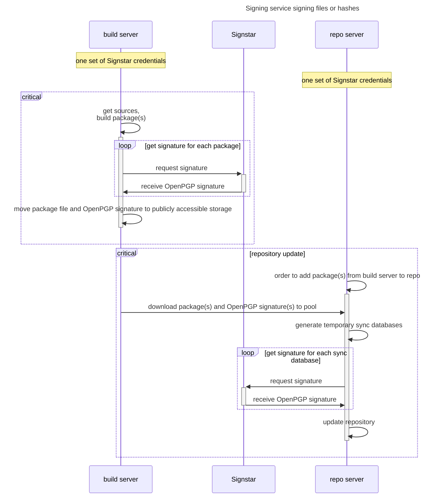
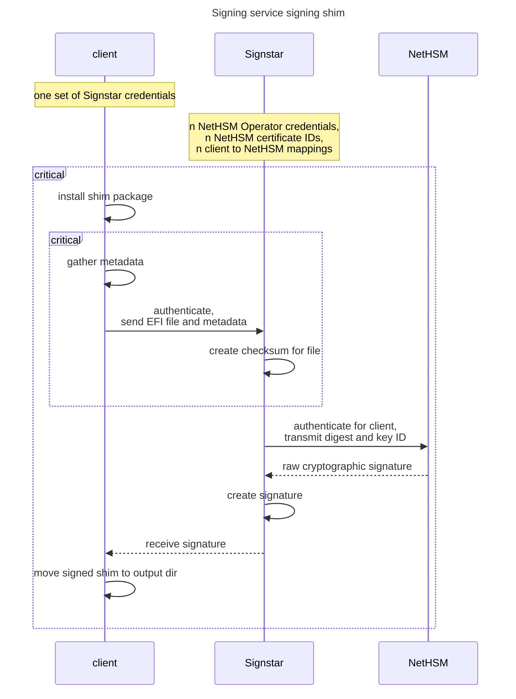

# Design documentation

This document outlines the design of the Signstar project in more detail.

**NOTE**: Until a test system ([%6]) is deployed, this document will likely undergo further revisions.

See [previous setup] for details on the setup upon which Signstar improves.

In [evaluated setups] all high-level setups which have been evaluated are listed.
Only one of them ([option C]) is considered for implementation.

## Threat model

The following assumptions are made with regard to the setup.

- HSM
    - The given HSM is a tamper-proof device, which fully prevents private key exfiltration.
    - Credentials required for administrative actions towards the HSM can be stored securely offline until they are needed for the (re)configuration of the HSM (e.g. initial setup, or creation of new keys and users).
    - Backups of the HSM are stored securely offline and allow restoring a device in case of disaster.
    - A collection of administrative credentials required for the (re)configuration of the HSM are distributed as shares of a shared secret, divided using [Shamir's Secret Sharing] ([SSS]) to dedicated individuals.
- Service host
    - A dedicated physical host managing all access to the HSM is used for its configuration and for granting access to signing operations.
    - A custom image-based operating system with a read-only root filesystem and an encrypted `/var` partition (with key enrolled to local [TPM2] chip) is used on the host.
      Relevant secrets such as SSH host keys and current Operator user credentials are kept in the encrypted partition, preventing offline exfiltration on harddrive theft or copy.
      The cryptographic key material used for secure boot and [verity signing] of the OS image, as well as that used for signing OS image artifacts are kept in offline backups and are only used with dedicated hardware tokens when building images of the OS image.
      A compromise of the holder of either or both secure boot/[verity signing] or artifact signing key may lead to the creation of a compromised OS image.
      It is therefore advised to ensure proper deployment of update artifacts using quality gates.
    - The host is not directly accessible by system users of the image-based OS (i.e. via login shell over SSH) during runtime, but only via rescue environment.
    - Dedicated host credentials are used to collect the public key for a [WireGuard] connection, which is setup during first boot and is used exclusively for securely diverting system logs and metrics to a hardcoded host.
    - Administrative credentials for the configuration of the HSM are provided to the host OS as shares of a shared secret, divided using [SSS].
      They are held in tmpfs and removed once the administrative action is finished or a predefined timeout is reached.
    - Passphrases for unprivileged user actions on the [NetHSM] are rotated on each (re)configuration of the system and are never persisted outside of the host.
    - A backup is created after each successful (re)configuration of the [NetHSM].
    - If a shareholder of the shared secret to the administrative credentials of the HSM is compromised, loses access to the share or leaves the organization, a reconfiguration of the administrative credentials takes place, rotating all credentials and making new shares for a shared secret available for download to current shareholders.
      If `n` out of `m` shareholders are compromised, an attacker needs physical access to the [NetHSM] or the backups to be able to either remove keys or use them for cryptographic operations.
    - During runtime the OS grants access to unprivileged user credentials (e.g. *Operator*, *Metrics* and *Backup*) of the HSM to pre-configured system users.
      If credentials for a pre-configured system user account are compromised, an attacker may use the account solely in the context of its role (e.g. to sign artifacts, to retrieve metrics or encrypted backups).
      Credentials for the host's system users can be changed transparently, reproducibly and in a fast manner by upgrading the host's OS.
    - Logs and metrics of the host are aggregated securely and are accessible for continuous monitoring of the OS and its critical facilities.
    - A public transparency log is appended to by the signing facilities for each requested signature, which provides insights into all signing operations done by the system.
    - Transparency log monitoring is done by a system outside of the scope of the Signstar project.
    - The *service host* has access to *Operator* credentials which allows using available signing keys on the [NetHSM].
      If the *service host* is fully compromised, it can issue signatures using those signing keys while sidestepping additions to a transparency log.
      The operating system must only provide tooling for signing in the narrow scope described by the Signstar project to prevent the use of signing keys for other use-cases.
- Client
    - Clients to the signing service can each be provided with credentials to the service in a dedicated scope (e.g. hardware backed and service specific) and have no access to the actual *Operator* (or any other) credentials of the HSM.
    - Some or all signstar clients may run in untrusted environments or may run untrusted or unsafe code (e.g. build servers during build time), which may lead to them being compromised.
    - Known compromised clients can either be shutdown and/ or be disconnected from the signing service by re-configuring the service with altered or removed credentials for the respective clients.
    - Clients don't have direct access to signing keys nor can they directly influence the structure of signatures.
- Digital Signatures
    - Digital signatures are requested by designated clients to the service host.
      If the client host or its credentials for the service host are compromised, either the client host is deactivated and/ or its credentials for the service host are removed or changed.
      All identified malicious signatures are gathered and affected artifacts are rebuilt or resigned.
      Depending on severity of the breach, all artifacts in direct circulation still signed by the the affected key material can be rebuilt and signed by a different key.
      Afterwards the affected key material in its entirety or simply its trust level can be revoked, ensuring that end-users no longer trust signatures made by this key.
      Finally, a public report lists all known affected artifacts and signatures and outlines the chosen mitigation steps.
    - Digital signatures contain metadata about the environment in which they were created.
      This helps in identifying signature requester, signed payloads and information about the involved hosts.

## Setup

Signstar as a signing service is meant to be run as a set of middleware applications on a physical host, fronting a Nitrokey [NetHSM].

The signing service allows for assigned users to request signatures, metrics and backups.
For system modification related tasks, dedicated credentials are used to provide shares of a shared secret for the (re)configuration of the HSM and backups files to restore from.

### Hardware Security Module

The [NetHSM] offers users of different roles in segregated [namespaces]:

- *Administrator* (*R-Administrator* for system-wide and *N-Administrator* for per-namespace *Administrator*): for creating, removing and modifying unprivileged users (e.g. *Operator*, *Backup*, *Metrics*), creating, removing and modifying of keys and all other system-level privileged actions
- *Operator*: for cryptographic operations using accessible keys (may exist system-wide or in a namespace)
- *Metrics*: for pulling metrics of the HSM (may only exist system-wide)
- *Backup*: for downloading encrypted backups of the HSM, containing device settings, user setups and keys (may only exist system-wide)

The *Administrator* credentials are needed for initial setup of the appliance, as well as any ongoing maintenance tasks that involve adding, removing or modifying users or keys.
Each *Operator* account is assigned exactly *one* private signing key of the HSM (using the tags system of the [NetHSM]).

The user setup is explained in more detail in the [configuration section].

### Signing service

The signing service host is a physical machine running the custom image-based operating system [SignstarOS] (based on Arch Linux), running from a read-only root filesystem (with [verity signing] support) and an encrypted `/var` partition for state, such as SSH host keys and per-user configuration.
Its central configuration and user setup is provided through OS updates.

Per-user configuration files for the integration with the [NetHSM] are created and changed in a persistent location by a dedicated tool, once administrative credentials have been passed to the host.
Administrative credentials for the HSM are provided by designated individuals as shares of a secret divided using [Shamir's Secret Sharing] ([SSS]) algorithm.

Authentication towards the signing service host is provided over SSH for credentials mapped to user roles on the HSM, that allow for unprivileged operations (i.e. *Operator*, *Metrics* and *Backup* users), for special system users that allow providing specific system-altering configuration (e.g. [WireGuard] configuration items, backup files, or shares of the administrative credentials) or for downloading purposes (e.g. key certificates, or shares of administrative credentials).

Dedicated software components provide access for authenticated users to these different functionalities:

- `signstar-download-signature`: for signing messages using HSM *Operator* credentials
- `signstar-download-backup`: for receiving backups of the HSM using HSM *Backup* credentials
- `signstar-download-key-certificate`: for downloading the certificates (e.g. OpenPGP certificates) of all keys
- `signstar-download-metrics`: for retrieving metrics of the device using HSM *Metrics* credentials
- `signstar-download-secret-share`: for downloading (new) individual shares of a secret (containing administrative credentials) divided using [SSS]
- `signstar-download-wireguard`: for downloading the public key of the [WireGuard] setup used for diverting logs and metrics to a dedicated host
- `signstar-upload-backup`: for uploading a backup file, to be used in a system restore action
- `signstar-upload-secret-share`: for providing HSM administrative credentials as shares of a secret divided using [SSS]
- `signstar-upload-update`: for uploading [NetHSM] firmware updates

Additionally, the `signstar-configure` executable is used to (re)configure the HSM and per-user configuration files based on central configuration and provided administrative credentials.

### Signing service clients

All signing service clients should rely on tamper-proof hardware (e.g. [TPM2], or hardware token) to guard *dedicated* credentials for connecting to the signing service.

### Networking

The Signstar setup is run on a dedicated host, that on one hand is exposed to the network of its clients, and on the other to the network of the NethHSM.

It is advisable to not expose the [NetHSM] to the network beyond that of the host running [SignstarOS].



### Authentication

Clients authenticate against the signing service host as individual Unix users over SSH and each user is assigned an executable as dedicated component for their use-case.
Credentials to the HSM are never directly exposed to the clients of the signing service host.



The following executables rely on a per-user configuration, that provides a one-to-one mapping of signing service host credentials to HSM *Operator*, *Backup* and *Metrics* credentials.

```sshd_config
Match user signer
    ForceCommand /usr/bin/signstar-download-signature
Match user backup
    ForceCommand /usr/bin/signstar-download-backup
Match user metrics
    ForceCommand /usr/bin/signstar-download-metrics
Match user certificates
    ForceCommand /usr/bin/signstar-download-key-certificates
```

The following executables do not rely on a [NetHSM] user mapping, as they are only used to provide data to the system or download data generated by the system, but not to interact with the HSM.

```sshd_config
Match user backup-upload
    ForceCommand /usr/bin/signstar-upload-backup
Match user secret-share-download
    ForceCommand /usr/bin/signstar-download-secret-share
Match user secret-share-upload
    ForceCommand /usr/bin/signstar-upload-secret-share
Match user update-upload
    ForceCommand /usr/bin/signstar-upload-update
Match user wireguard-download
    ForceCommand /usr/bin/signstar-download-wireguard
```

### Logs and metrics

Syslogs of [NetHSM] devices are collected on the signing service host.
Both the HSM syslogs and the host's own [systemd-journald] are consumed by [Promtail] and sent to a dedicated [Grafana Loki] logging host over a [WireGuard] tunnel.



Metrics for the [NetHSM] are collected using a custom [Prometheus] metrics exporter which relies on *Metrics* user credentials of the HSM for device metrics and a set of dedicated *Operator* user credentials for per-key metrics.
Metrics for the signing service host itself are collected separately.
All metrics are scraped using [Prometheus] over a [WireGuard] tunnel.



### Configuration

The configuration of the signing service host is changed by [upgrading] its read-only operating system [SignstarOS].
The basic configuration of the [NetHSM] (i.e. its available users and keys) is set and altered using a central, versioned configuration file on the signing service host, which does not include any passphrases.

Passphrases for common (unprivileged) operations towards the [NetHSM] are kept in per-user configuration files and can only be created when (re)configuring the HSM using administrative credentials.

The administrative credentials for the [NetHSM] (for (re)configuration actions) are provided to the signing service host by designated shareholders of a shared secret, divided using [Shamir's Secret Sharing].

The shared secret contains the unlock and backup passphrases and all *Administrator* credentials of the [NetHSM].
If one of these is changed or a new one is added, the shared secret is recreated and shareholders must download their shares anew.

Configuration actions towards the [NetHSM] relate to users in the *Administrator* role: System-wide (*R-Administrator* - *R*) or per [namespaces] (*N-Administrator* - *N*).

**NOTE**: To segregate groups of users and their access to keys, [namespaces] for each purpose are created (e.g. "release artifact signing", "repository sync database signing", "package signing").

- provision (*R*)
- configure TLS setup (*R*)
- reboot system (*R*)
- shut down system (*R*)
- factory reset system (*R*)
- restore from backup (*R*)
- set network configuration (*R*)
- set logging configuration (*R*)
- set boot mode (*R*)
- set backup passphrase (*R*)
- set unlock passphrase (*R*)
- create *Administrator* user (*R*)
- remove *Administrator* user (*R*)
- create *Backup* user (*R*)
- remove *Backup* user (*R*)
- create *Metrics* user (*R*)
- remove *Metrics* user (*R*)
- create *Administrator* user in namespace (*R*)
- create namespace (*R*)
- delete namespace (*R*)
- create *Operator* user in  namespace (*N*)
- remove *Operator* user in namespace (*N*)
- set passphrase for *Operator* user in namespace (*N*)
- generate key in namespace (*N*)
- remove key in namespace (*N*)
- tag key in namespace (*N*)
- untag key in namespace (*N*)
- tag user in namespace (*N*)
- untag user in namespace (*N*)

When it comes to configuration, one can distinguish between privileges required for initial and those required for ongoing administrative operations.

#### Initial

An initial configuration encompasses device, user and key configuration.

- provision (*R*)
- configure TLS setup (*R*)
- reboot system (*R*)
- shut down system (*R*)
- factory reset system (*R*)
- restore from backup (*R*)
- set network configuration (*R*)
- set logging configuration (*R*)
- set boot mode (*R*)
- set backup passphrase (*R*)
- set unlock passphrase (*R*)
- create *N-Administrator* user in namespace (*R*)
- create namespace (*R*)
- create *Operator* user in namespace (*N*)
- generate key in namespace (*N*)
- tag key in namespace (*N*)
- tag user in namespace (*N*)

#### Ongoing system maintenance

When the device-level configuration changes, the system-wide *Administrator* credentials are required.

- configure TLS setup (*R*)
- reboot system (*R*)
- shut down system (*R*)
- factory reset system (*R*)
- restore from backup (*R*)
- set network configuration (*R*)
- set logging configuration (*R*)
- set boot mode (*R*)
- set backup passphrase (*R*)
- create system-wide *Operator* user (*R*)
- create system-wide *Backup* user (*R*)
- create system-wide *Metrics* user (*R*)
- create *N-Administrator* user in namespace (*R*)
- create namespace (*R*)
- delete namespace (*R*)

#### Ongoing key and user maintenance

Ongoing key and user configuration entails the addition, removal and modification of existing users and keys.

- create *Operator* user in  namespace (*N*)
- remove *Operator* user in namespace (*N*)
- set passphrase for *Operator* user in namespace (*N*)
- generate key in namespace (*N*)
- remove key in namespace (*N*)
- tag key in namespace (*N*)
- untag key in namespace (*N*)
- tag user in namespace (*N*)
- untag user in namespace (*N*)

### Deployment

The signing service host is instantiated by deploying an [installation image] of [SignstarOS] onto a host with [UEFI] support in ["setup mode"].

During first boot, relevant partitions and [encrypted credentials] are created.

After first boot dedicated system credentials are used to download the public key for a [WireGuard] tunnel to a host used for logging and metrics aggregation.

If the attached [NetHSM] is unprovisioned, administrative credentials are generated by the signing service host and made available as shares of a shared secret, divided using [Shamir's Secret Sharing].
After successful download of all shares, the system provisions the [NetHSM], as well as dedicated system user configurations and removes the administrative credentials.

After successful initial configuration, dedicated credentials are used to download an encrypted backup of the [NetHSM].



### Upgrading

The signing service host is upgraded by providing relevant [update artifacts] on a specific webserver.
[SignstarOS] upgrades autonomously with the help of [systemd-sysupdate].

Upgrades to the [NetHSM] are uploaded to the signing service host using designated credentials, which make use of *signstar-upload-update*.
Once sufficient shares of the shared administrative credentials are uploaded after that, the [NetHSM] is updated using *signstar-configure*.

### Restoring

The signing service host is bound to its particular hardware.
If the hardware fails, a new physical host must be connected, which has to undergo initial [deployment].

To restore a [NetHSM] from backup, a backup file is uploaded using designated credentials, which make use of *signstar-upload-backup*.
Once sufficient shares of the shared administrative credentials *used for creating the backup* are uploaded after that, the [NetHSM] is restored using *signstar-configure*.

### Signing

The central feature of the signing service is to allow (otherwise unprivileged) users on that host to request cryptographic signatures backed by an HSM.



#### Signature request payload

Clients may request a signature for very large artifacts, which leads to congestion on the signing service host (as observed in other signing solutions such as [sigul]).
To prevent this from happening signstar will employ a custom machine-readable payload format (tracked in [#41]), that contains required metadata and pre-hashed data for a signature.

Making use of this custom payload comes at the downside, that the signing service never directly interacts with the specific artifact to sign and solely relies on provided metadata (which may be fraudulent).

When transmitting actual artifacts to sign, the signing service would be able to evaluate and/ or validate an artifact.
However, this comes at the downside of having to employ custom parsers and validation tools, which may slow down the signing process significantly and also increase the attack surface of the setup.

#### Attestation log

An attestation log is a tamper-resistent and append-only data structure to which the resulting raw cryptographic signatures from signing operations are appended to.
Additional metadata in an entry should provide insight into caller of the signing operation, the alleged payload and the certificate or fingerprint of the issuer.

Writing to an attestion log happens exclusively on the signing service host in an environment only exposing signing capabilities to authenticated users.

Work on attestation log integration is tracked in [#43].

#### Threshold signatures

To further manifest and strengthen the [Arch Linux reproducible builds] effort, it is possible to build a system in the future in which only reproducible artifacts are eligible for a signature.

In such a system, `m` build machines create the artifact in question and each request a signature from the Signstar system.
Only if a threshold of `n` (where `n <= m`) identical artifacts is met, a signature is created.

#### OpenPGP

Private keys stored on the HSM may be used for OpenPGP signatures.

For this a dedicated certificate with a [User ID] specific to a single host is created (e.g. `Build Host 1 <buildhost1@archlinux.org>`).
When used in a packaging context, an OpenPGP certificate should not be created with an expiration time, as its validity is determined by a PGPKI (aka. [Web of Trust], as provided by [archlinux-keyring]).
Single [component key] certificates are preferred in a packaging context, because a [signing key] is not used for authentication, encryption or third-party certification.
Moreover, certificates with multiple component keys also require combining and using multiple private keys on the HSM, which is currently not yet supported (see [#50]).

When creating OpenPGP signatures, the signing service may append the transaction metadata (e.g. file metadata, requesting client) as [notations] in the [hashed area] of the signature.
In the future the position of the signature in an [attestation log], may additionally be appended in the [unhashed area] of the signature.

[OpenPGP signatures] consist of OpenPGP packets (see [packet structure of data signatures]), that contain raw cryptographic signatures (e.g. those created by an HSM).
As such, Signstar is responsible for issuing cryptographic signatures in the correct "framing".



### Packages and repository sync databases

By unifying the surface for how clients interact with the signing service, it is possible to improve over the previous setup for [packages] and [repository sync databases] by requesting signatures transparently from centrally managed build and repository server hosts.

Here the signature issuing takes place as outlined in the section on [OpenPGP signing].



### Secure Boot Shim

A signed shim can be created by first (reproducibly) building the [shim] package and afterwards signing the resulting EFI binary.
This requires [X.509] support, which is tracked in [#51].



[Grafana Loki]: https://grafana.com/docs/loki/latest/
[NetHSM]: https://www.nitrokey.com/products/nethsm
[OpenPGP signatures]: https://openpgp.dev/book/signatures.html
[OpenPGP signing]: #openpgp
[Prometheus]: https://prometheus.io/
[Promtail]: https://grafana.com/docs/loki/latest/send-data/promtail/
[Shamir's Secret Sharing]: https://en.wikipedia.org/wiki/Shamir%27s_secret_sharing
[SignstarOS]: ../mkosi/signstar/README.md
[SSS]: https://en.wikipedia.org/wiki/Shamir%27s_secret_sharing
[WireGuard]: https://en.wikipedia.org/wiki/WireGuard
[TPM2]: https://en.wikipedia.org/wiki/Trusted_Platform_Module
[UEFI]: https://en.wikipedia.org/wiki/UEFI
[UKI]: https://uapi-group.org/specifications/specs/unified_kernel_image/
[User ID]: https://openpgp.dev/book/glossary.html#term-User-ID
[Web of Trust]: https://openpgp.dev/book/signing_components.html#wot
[X.509]: https://en.wikipedia.org/wiki/X.509
[archlinux-keyring]: https://gitlab.archlinux.org/archlinux/archlinux-keyring
[attestation log]: #attestation-log
[component key]: https://openpgp.dev/book/glossary.html#term-OpenPGP-Component-Key
[configuration section]: #configuration
[deployment]: #deployment
[encrypted credentials]: https://systemd.io/CREDENTIALS/
[evaluated setups]: evaluated-setups.md
[hashed area]: https://openpgp.dev/book/signatures.html#hashed-and-unhashed-signature-subpackets
[installation image]: ../mkosi/signstar/README.md#installation
[namespaces]: https://docs.nitrokey.com/nethsm/administration#namespaces
[notations]: https://openpgp.dev/book/glossary.html#term-Notation
[option C]: evaluated-setups.md#signing-service-signing-files-or-hashes
[packages]: previous-setup.md#packages
[packet structure of data signatures]: https://openpgp.dev/book/zoom/signatures.html
[previous setup]: previous-setup.md
[repository sync databases]: previous-setup.md#repository-sync-databases
[Arch Linux reproducible builds]: https://wiki.archlinux.org/title/Reproducible_builds
[shim]: https://archlinux.org/packages/extra/any/shim/
[signing key]: https://openpgp.dev/book/glossary.html#term-Signing-Key-Flag
[sigul]: https://pagure.io/sigul/
[systemd-journal-upload]: https://man.archlinux.org/man/core/systemd/systemd-journal-upload.8.en
[systemd-journald]: https://man.archlinux.org/man/core/systemd/systemd-journald.8.en
[unhashed area]: https://openpgp.dev/book/signatures.html#hashed-and-unhashed-signature-subpackets
[update artifacts]: ../mkosi/signstar/README.md#updating
[upgrading]: #upgrading
["setup mode"]: https://wiki.archlinux.org/title/Unified_Extensible_Firmware_Interface/Secure_Boot#Putting_firmware_in_%22Setup_Mode%22
[systemd-sysupdate]: https://man.archlinux.org/man/systemd-sysupdate.8
[verity signing]: https://wiki.archlinux.org/title/Dm-verity
[%6]: https://gitlab.archlinux.org/archlinux/signstar/-/milestones/6
[#41]: https://gitlab.archlinux.org/archlinux/signstar/-/issues/41
[#43]: https://gitlab.archlinux.org/archlinux/signstar/-/issues/43
[#50]: https://gitlab.archlinux.org/archlinux/signstar/-/issues/50
[#51]: https://gitlab.archlinux.org/archlinux/signstar/-/issues/51
