# Evaluated setups

This document contains evaluated, but not considered setup concepts for signstar.

## Scenarios

In the below subsection all evaluated scenarios are listed.
The following list provides a more high-level overview of the evaluated features.

| Feature                                             | [A](#nethsm-directly) | [B](#signing-service-signing-hashes) | [C](#signing-service-signing-files-or-hashes) | [D](#signing-service-signing-files) | [E](#signing-service-signing-hashes-and-files-as-proxy) | [F](#signing-service-signing-files-as-proxy) |
|-----------------------------------------------------|-----------------------|--------------------------------------|-----------------------------------------------|-------------------------------------|---------------------------------------------------------|----------------------------------------------|
| attestation log                                     | ❌️                    | ✅️                                   | ✅️                                            | ❌️                                  | ✅️                                                      | ✅️                                           |
| central signing                                     | ❌️                    | ✅️                                   | ✅️                                            | ✅️                                  | ✅️                                                      | ✅️                                           |
| low complexity                                      | ✅️                    | ✅️                                   | ✅️                                            | ✅️                                  | ❌️                                                      | ❌️                                           |
| client crypto backend unaware [1]                   | ❌️                    | ✅️                                   | ✅️                                            | ✅️                                  | ✅️                                                      | ✅️                                           |
| no direct client access to hardware appliance       | ❌️                    | ✅️                                   | ✅️                                            | ✅️                                  | ✅️                                                      | ✅️                                           |
| no direct build server access to repo server        | ❌️                    | ❌️                                   | ✅️                                            | ❌️                                  | ✅️                                                      | ✅️                                           |
| no direct signing service access to repo server     | ✅️                    | ✅️                                   | ✅️                                            | ✅️                                  | ❌️                                                      | ❌️                                           |
| no transmission of files from build server          | ✅️                    | ✅️                                   | ✔️                                             | ❌️                                  | ✔️                                                       | ❌️                                           |
| no custom wire format                               | ✅️                    | ❌️                                   | ❌️                                            | ❌️                                  | ❌️                                                      | ❌️                                           |
| no workflow complexity offloaded to signing service | ✅️                    | ✅️                                   | ✅️                                            | ✅️                                  | ❌️                                                      | ❌️                                           |

[1]: https://openpgp.dev/book/signatures.html#creating-an-openpgp-signature-packet

### HSM directly

The clients directly interact with the hardware appliance (there is no signing service).

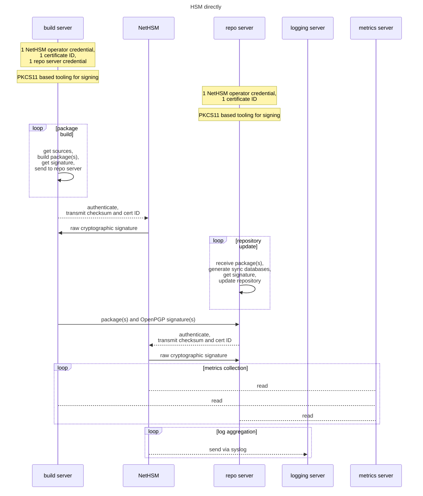

### Signing service signing hashes

In this setup a microservice takes care of taking authenticated client requests and issuing signatures for the request via a PKCS#11 backend.

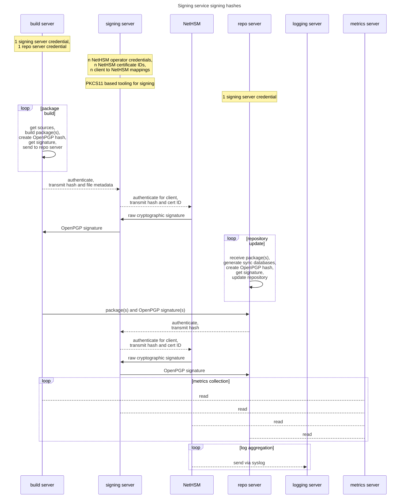

The signing process in more detail may look as follows:

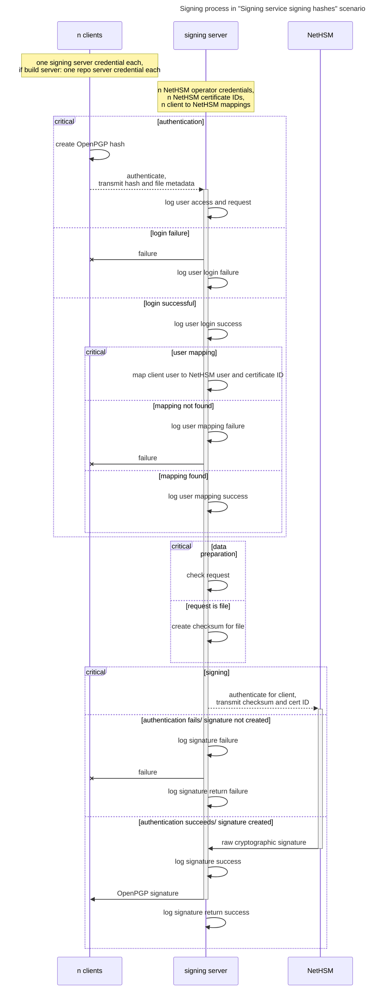

Here, the `n clients` may be build servers or the repository server, as they are functionally equal in behavior.

### Signing service signing files or hashes

In this setup a microservice takes care of taking authenticated client requests and issuing signatures for the request via a PKCS#11 backend.
Clients may send checksums or entire files using a custom wire format.

On a build server the signed packages are exposed via a static webserver location.

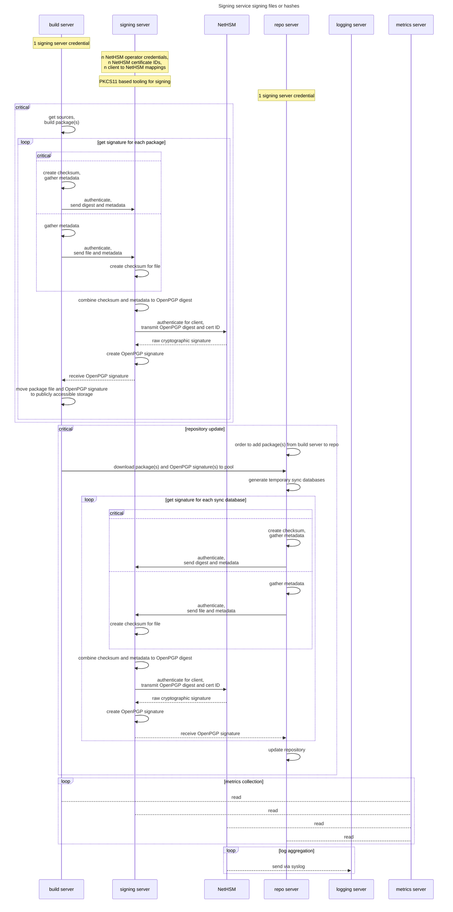

The signing process in more detail may look as follows:

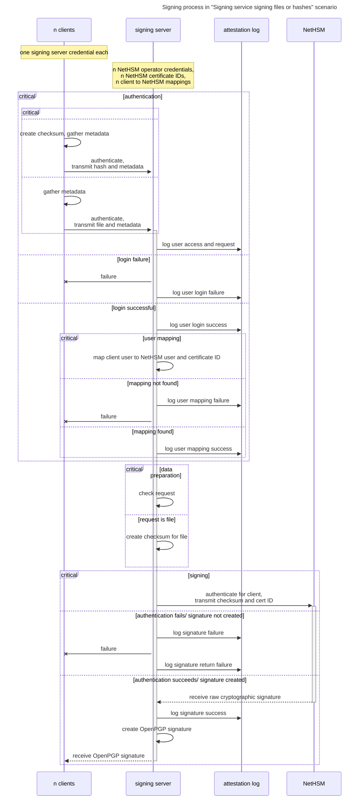

Here, the `n clients` may be build servers or the repository server, as they are functionally equal in behavior.

### Signing service signing files

In this setup a microservice takes care of taking authenticated client requests and issuing signatures for the request via a PKCS#11 backend.
The client sends entire files to the service.

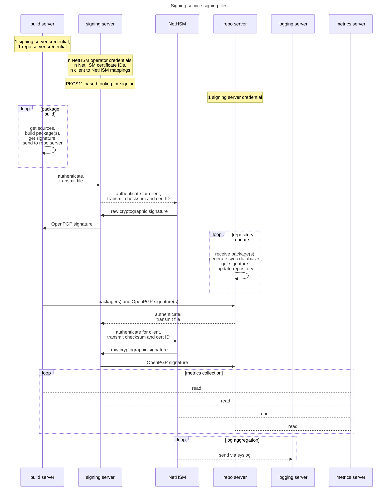

The signing process in more detail may look as follows:

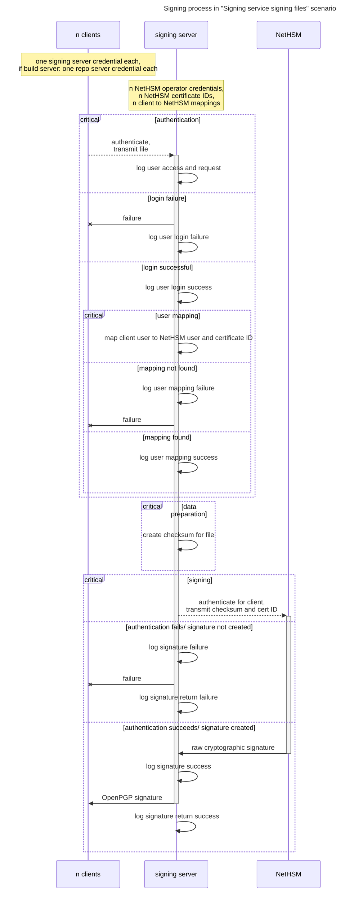

Here, the `n clients` may be build servers or the repository server, as they are functionally equal in behavior.

### Signing service signing hashes and files as proxy

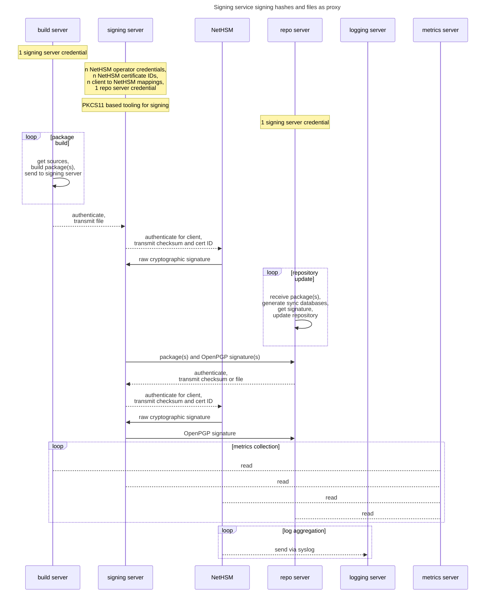

The signing process in more detail may look as follows:

```mermaid
---
title: Signing process in "Signing service signing hashes and files as proxy" scenario
---
sequenceDiagram
    participant B as n build clients
    participant R as one repo client
    participant S as signing server
    participant N as NetHSM

    Note over B: 1 signing server credential each
    Note over R: 1 signing server credential
    Note over S: n NetHSM operator credentials,<br/>n NetHSM certificate IDs,<br/>n client to NetHSM mappings,<br/>repo server credential

    critical data aggregation
        B ->> B: aggregate packages and metadata (e.g. target repo) in single file
    end
    critical authentication
        B -->>+ S: authenticate,<br/>transmit package(s) and target repo
        S ->> S: log user access and request
    option login failure
        break login failure
            S ->> S: log user login failure
            S -x B: failure
        end
    option login success
        S ->> S: log user login success
        critical user mapping
            S ->> S: map client user to NetHSM user and certificate ID
        option mapping not found
            break user mapping not found
                S ->> S: log user mapping failure
                S -x B: failure
            end
        option mapping found
            S ->> S: log user mapping success
            S ->> B: success
        end
    end

    loop data preparation
        S ->> S: create checksum for package
    end

    loop get signature(s)
        critical signing
            S ->>+ N: authenticate for client,<br/>transmit checksum and cert ID
        option authentication fails/ signature not created
            S ->> S: log signature failure
        option authentication succeeds/ signature created
            N ->>- S: raw cryptographic signature
            S ->> S: log signature success
        end
    end

    critical send to repo server
        S ->>- R: authenticate,<br/>transmit package(s), OpenPGP signature(s) and target repo
    option authentication failure
        S ->> S: log failure of transmitting package(s), OpenPGP signature(s) and target repo
    option authentication success
        S ->> S: log success of transmitting package(s), OpenPGP signature(s) and target repo
    end

    loop payload preparation
        R ->> R: create OpenPGP hash for database and collect file metadata
    end
    critical authentication
        R -->>+ S: authenticate,<br/>transmit OpenPGP hash and file metadata
        S ->> S: log user access and request
    option login failure
        break login failure
            S ->> S: log user login failure
            S -x R: failure
        end
    option login successful
        S ->> S: log user login success
        critical user mapping
            S ->> S: map client user to NetHSM user and certificate ID
        option mapping not found
            break user mapping not found
                S ->> S: log user mapping failure
                S -x R: failure
            end
        option mapping found
            S ->> S: log user mapping success
        end
    end

    loop get signature(s)
        critical signing
            S ->>+ N: authenticate for client,<br/>transmit checksum and cert ID
        option authentication fails/ signature not created
            break signature failure
                S ->> S: log signature failure
                S -x R: failure
            end
        option authentication succeeds/ signature created
            N ->>- S: raw cryptographic signature
            S ->> S: log signature success
        end
    end

    critical return of signature(s)
        S ->>- R: OpenPGP signature(s)
    option signature(s) not returned
        S ->> S: log failed return of OpenPGP signature(s)
    option signature(s) returned
        S ->> S: log successful return of OpenPGP signature(s)
    end
```

### Signing service signing files as proxy

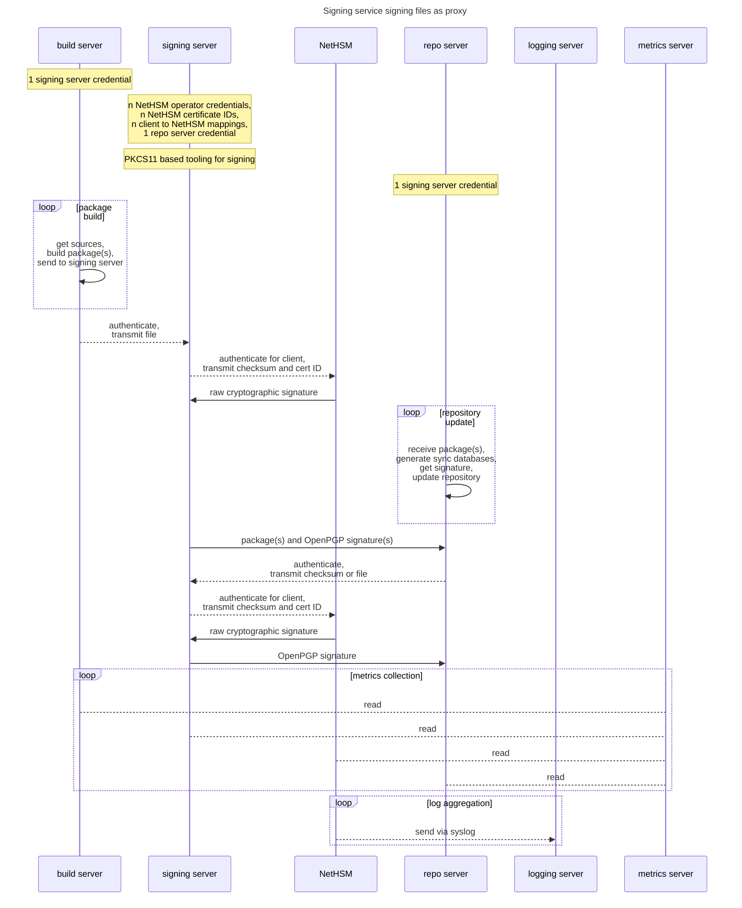

The signing process in more detail may look as follows:

```mermaid
---
title: Signing process in "Signing service signing files as proxy" scenario
---
sequenceDiagram
    participant B as n build clients
    participant R as one repo client
    participant S as signing server
    participant N as NetHSM

    Note over B: 1 signing server credential each
    Note over R: 1 signing server credential
    Note over S: n NetHSM operator credentials,<br/>n NetHSM certificate IDs,<br/>n client to NetHSM mappings,<br/>repo server credential

    critical data aggregation
        B ->> B: aggregate packages and metadata (e.g. target repo) in single file
    end
    critical authentication
        B -->>+ S: authenticate,<br/>transmit package(s) and target repo
        S ->> S: log user access and request
    option login failure
        break login failure
            S ->> S: log user login failure
            S -x B: failure
        end
    option login success
        S ->> S: log user login success
        critical user mapping
            S ->> S: map client user to NetHSM user and certificate ID
        option mapping not found
            break user mapping not found
                S ->> S: log user mapping failure
                S -x B: failure
            end
        option mapping found
            S ->> S: log user mapping success
            S ->> B: success
        end
    end

    loop data preparation
        S ->> S: create checksum for package
    end

    loop get signature(s)
        critical signing
            S ->>+ N: authenticate for client,<br/>transmit checksum and cert ID
        option authentication fails/ signature not created
            S ->> S: log signature failure
        option authentication succeeds/ signature created
            N ->>- S: raw cryptographic signature
            S ->> S: log signature success
        end
    end

    critical send to repo server
        S ->>- R: authenticate,<br/>transmit package(s), OpenPGP signature(s) and target repo
    option authentication failure
        S ->> S: log failure of transmitting package(s), OpenPGP signature(s) and target repo
    option authentication success
        S ->> S: log success of transmitting package(s), OpenPGP signature(s) and target repo
    end

    critical authentication
        R -->>+ S: authenticate,<br/>transmit database(s)
        S ->> S: log user access and request
    option login failure
        break login failure
            S ->> S: log user login failure
            S -x R: failure
        end
    option login successful
        S ->> S: log user login success
        critical user mapping
            S ->> S: map client user to NetHSM user and certificate ID
        option mapping not found
            break user mapping not found
                S ->> S: log user mapping failure
                S -x R: failure
            end
        option mapping found
            S ->> S: log user mapping success
        end
    end

    loop data preparation
        S ->> S: create checksum for database
    end

    loop get signature(s)
        critical signing
            S ->>+ N: authenticate for client,<br/>transmit checksum and cert ID
        option authentication fails/ signature not created
            break signature failure
                S ->> S: log signature failure
                S -x R: failure
            end
        option authentication succeeds/ signature created
            N ->>- S: raw cryptographic signature
            S ->> S: log signature success
        end
    end

    critical return of signature(s)
        S ->>- R: OpenPGP signature(s)
    option signature(s) not returned
        S ->> S: log failed return of OpenPGP signature(s)
    option signature(s) returned
        S ->> S: log successful return of OpenPGP signature(s)
    end
```
