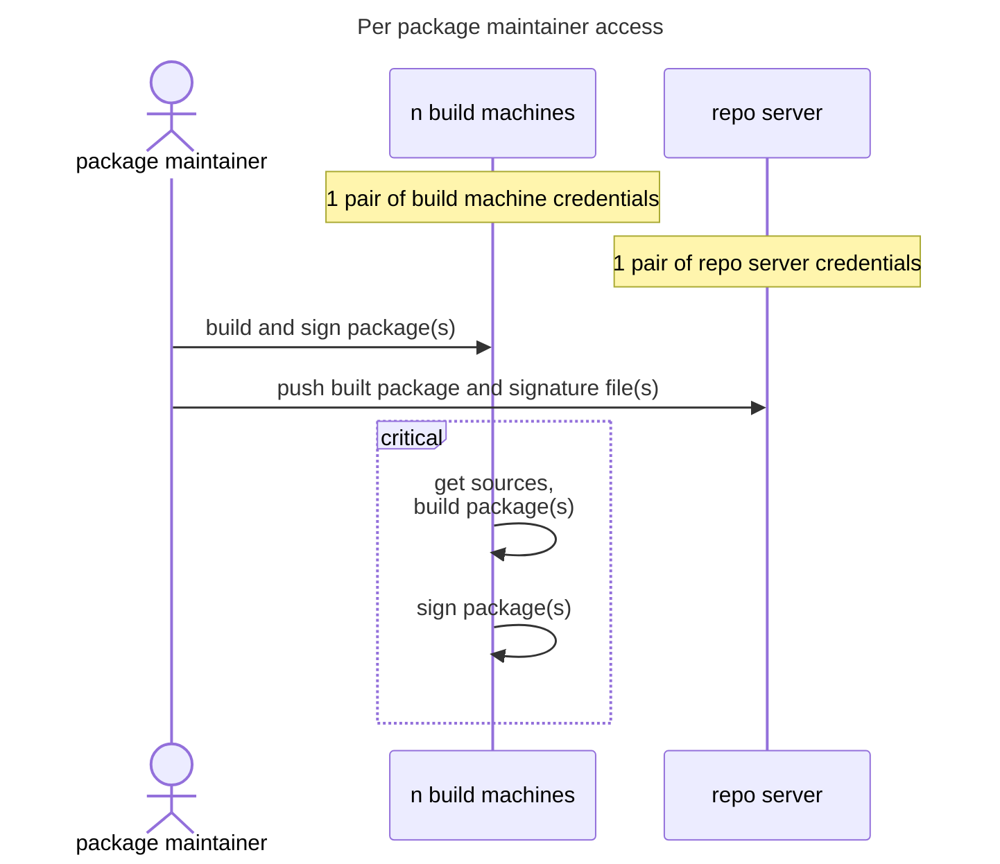
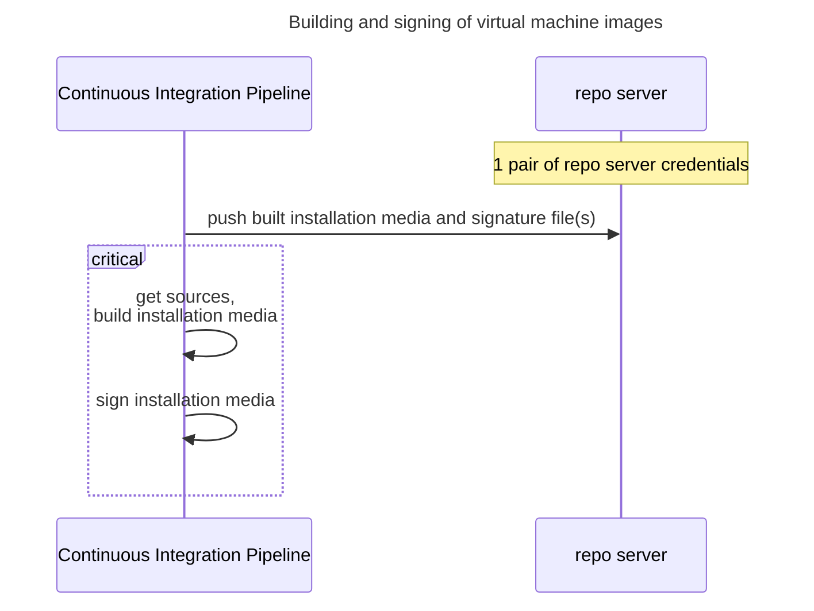
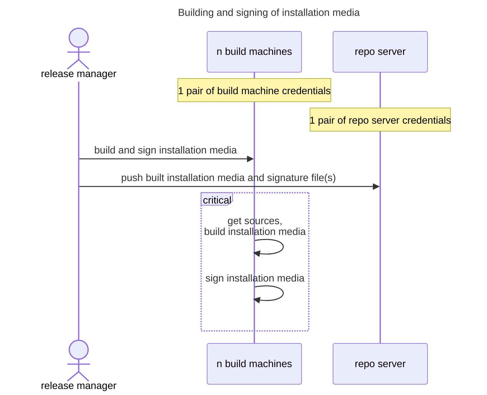

# Previous setup

This document provides an overview of the workflows and contexts for package creation and other artifacts on Arch Linux as it has been until at least 2024.

## Packages

The packaging infrastructure involves creating packages on `n` machines that `m` package maintainers have access to.

In many cases, the same machine is also used for cryptographically signing the resulting package file(s).
There is no overview over whether package maintainers use hardware tokens for this to prevent key exfiltration and no way to enforce it either.

From `n` machines that `m` package maintainers have access to, package and detached signature files are copied to a central package repository server.

## Repository sync databases

The central repository server is responsible for creating the repository sync database files, which define the state of each binary package repository.
Repository sync databases are not signed as that would involve either forwarding gpg-agent to the host from `n` machines that `m` package maintainers have access to (security and blocking issue), or to add a software key to the host (which may be exfiltrated easily).

## Release artifacts

Other artifacts such as installation media and virtual machine images are built semi-automatically or manually and are usually cryptographically signed.

Signing happens either with a software key in CI (in the case of virtual machine images) and is prone to exfiltration attacks, or manual on a single person's machine.

## Secure Boot Shim

There is so far no signed shim for Secure Boot, as the location and safe-keeping of a signing key as well as its use for signature creation in packaging is so far unsolved.

