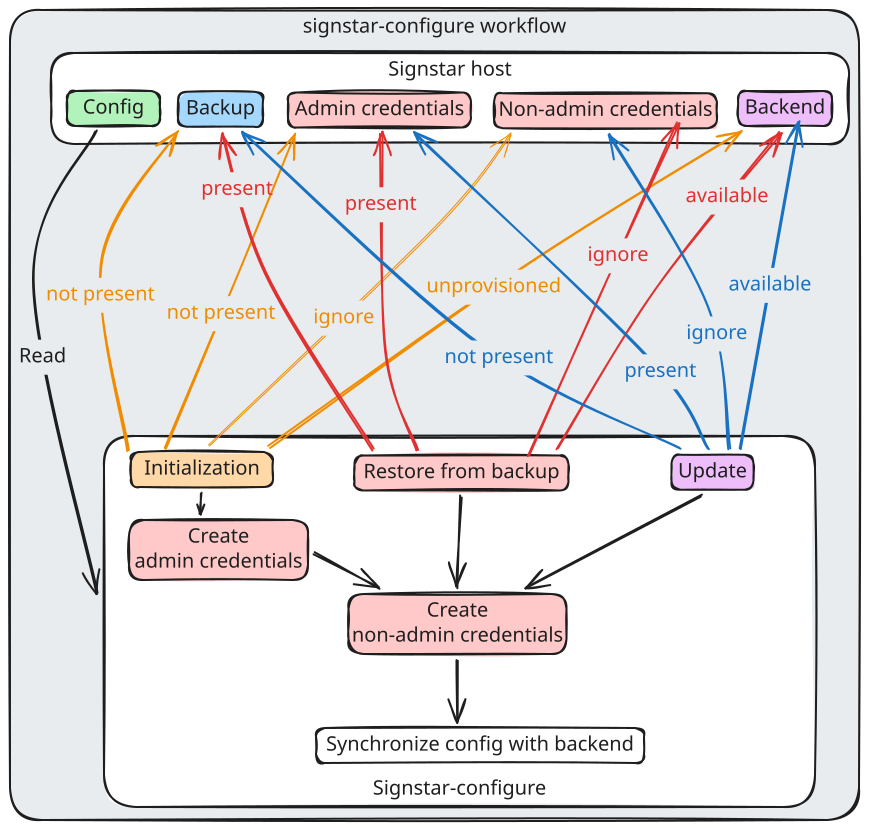

# Architecture

This project tries to opportunistically configure all backends it is aware of in a way that is consistent with the Signstar configuration file on the _Signstar host_.

## Functionality and integration

The executable must be run as root, and is meant to be run repeatedly on a timer after boot (e.g. using a [systemd.timer] unit).
Running the application repeatedly allows to react to changes with regards to the administrative credentials or backends, apply backups, etc.

An initial run of the executable is meant to be used in [Automatic Boot Assessment] scenarios to establish whether the system consistently fails to boot and reverting to a previous state of the _Signstar host_ should be attempted.
`signstar-configure` may fail for various reasons and exit with a non-zero status code.
Any possible failure is of one of the following two categories:

- **unrecoverable**: The Signstar system is irreparably broken and needs to be reset (potentially booted into a previous version).
- **recoverable**: The Signstar system is missing required input data or the backend is not available (the executable may succeed when rerunning it).

The `signstar-configure` executable is able to restore an HSM backend from backup.
Each backup file is tied to a very specific set of administrative credentials and a specific Signstar configuration file.
The specific set of administrative credentials allow to apply the backup and make use of all administrative accounts available in the backend.
The version match between backup file, Signstar configuration file and administrative credentials is referred to as an _iteration_.

## Dependencies

The `signstar-configure` executable depends on correct system time and should therefore only run after the system clock has been synchronized successfully.

## System configuration

When running `signstar-configure`, the execution flow passes through several stages.
Each stage may have a set of **inputs**, **outputs** and/or **optional-outputs**.
All **outputs** and **optional-outputs** can be made available to the following stages.

Each stage may abort based on **unrecoverable** or **recoverable** errors.
Many stages may be skipped based on whether a **condition** can not be met.

### Read configuration

A Signstar configuration file on the system is read from one of the default locations.

- **input**: Signstar configuration file.
- **unrecoverable**: There is no configuration file, or the configuration file can not be read or is invalid.
- **output**: The configuration object, which covers general configuration options, a set of connections and a set of user mappings.

### Check connections

Each backend connection _configured_ in the Signstar configuration file is checked.
As a fallback, the hardcoded default connection - if applicable - of an unprovisioned HSM backend is checked.

First, each exact _configured_ connection is probed for availability.
If there is only one _configured_ connection and it is not reachable at the _configured_ address, the _default_ connection is probed instead.

If there is more than one connection, with none of them reachable, the default connection is probed instead for the first unreachable connection.

If there is more than one connection, with at least one of them in _locked_ or _operational_ state and one or more of them not reachable, the default connection is probed instead for the first unreachable connection.

- **input**: Signstar configuration object.
- **unrecoverable**: One of the connections fails due to TLS issues (e.g. the backend changed and does not provide the same TLS certificate as before).
- **recoverable**: A backend is not reachable (neither at its configured address, nor ath the hardcoded default address).
- **output**: A set of available connections.

### Read backup file

Any Signstar backup file present in the dedicated location is read and validated.

- **input**: Signstar backup file.
- **condition**: Signstar backup file exists.
- **recoverable**: More than one backup file has been uploaded and all are removed.
- **recoverable**: A backup file is not well-formed and is removed.
- **output**: A Signstar backup file.

### Read administrative credentials

All administrative credentials present on the _Signstar host_ are read and validated.
Administrative credentials may exist as persistent _plaintext_ files, _systemd-creds_ encrypted files or as ephemeral shares of a shared secret using [Shamir's Secret Sharing] (_SSS_).

- **input**: Signstar administrative credentials.
- **condition**: Signstar administrative credentials are present.
- **recoverable**: Administrative credentials are invalid and are removed.
- **output**: One or more sets of administrative credentials.

### Validate backup file with administrative credentials

If a Signstar backup file is present, use administrative credentials with a matching _iteration_ to validate the file.

- **input**: Signstar backup file.
- **input**: One or more sets of administrative credentials.
- **condition**: Signstar backup file exists.
- **condition**: Signstar administrative credentials are present.
- **recoverable**: Administrative credentials with a matching iteration can not be used for validating the Signstar backup file and the backup file is removed.
- **output**: Administrative credentials in particular iteration.

### Create administrative credentials

If all configured connections are _available_ and _unprovisioned_ and no backup file is present, create initial administrative credentials.
Type (_plaintext_, _systemd-creds_ encrypted files or shares of a shared secret using _SSS_) and location depend on the relevant Signstar configuration item.

- **input**: Signstar configuration object.
- **input**: Signstar backup file.
- **condition**: All available connections are in _unprovisioned_ state.
- **condition**: Signstar backup file does not exist.
- **unrecoverable**: Administrative credentials can not be created.
- **output**: Administrative credentials.

#### Ensure all shares of a shared secret are downloaded

If [Shamir's Secret Sharing] is configured for the administrative credentials
and administrative credentials are present in a runtime directory
and all available connections are in _unprovisioned_ state
and no backup file is present
check if all shares of the shared secret are downloaded.

To track the download state of each share in the login user's respective runtime directory, `signstar-configure` relies on accompanying state files that indicate them being downloaded at least once.

- **input**: Signstar backup file.
- **input**: Administrative credentials.
- **condition**: All available connections are in _unprovisioned_ state.
- **condition**: Administrative credentials are available.
- **condition**: [Shamir's Secret Sharing] is used for administrative credentials.
- **condition**: Signstar backup file does not exist.
- **recoverable**: Not all shared secrets are downloaded.

### Create non-administrative secrets

If administrative credentials are available, non-administrative secrets for backend users associated with each login user on the _Signstar host_ are created in a persistent, per-user location.

- **input**: Administrative credentials.
- **input**: Signstar configuration object.
- **condition**: Administrative credentials are available.
- **condition**: Iteration of administrative credentials matches that of the Signstar configuration object.
- **recoverable**: Administrative credentials are not available.
- **unrecoverable**: Non-administrative secrets can not be created.
- **output**: Non-administrative secrets.

### Provision first unprovisioned backend

If _all_ backends are (_available_ and) _unprovisioned_, no Signstar backup file exists and administrative credentials in an _iteration_ matching the Signstar configuration object are present on the system, provision the first backend using the administrative credentials in the particular version.

- **input**: Administrative credentials.
- **input**: Non-administrative secrets.
- **input**: Signstar configuration object.
- **condition**: All backends are _unprovisioned_.
- **condition**: Signstar backup file does not exist.
- **condition**: Iteration of administrative credentials matches that of the Signstar configuration object.
- **recoverable**: An error occurs while provisioning the backend because of connectivity issues and the non-administrative secrets are removed.

### Restore from backup file

If _all_ backends are _available_, a Signstar backup file exists and administrative credentials in an _iteration_ matching the Signstar configuration object are present on the system, restore all backends from it.
First restore any backend from backup, that is _unprovisioned_, then - on a best effort basis - attempt to restore from backup any backend that has already been _provisioned_ by iteratively trying the provided administrative credentials.

Afterwards, persist the newly created non-administrative secrets.
Remove the administrative credentials if [Shamir's Secret Sharing] is used and keep them with the matching iteration if [Shamir's Secret Sharing] is _not_ used.
Finally, remove the uploaded backup file.

- **input**: Administrative credentials.
- **input**: Non-administrative secrets.
- **input**: Signstar configuration object.
- **input**: Signstar backup file.
- **condition**: Signstar backup file exists.
- **condition**: Iteration of administrative credentials matches that of the Signstar backup file and Signstar configuration object.

### Synchronize backend

If _all_ backends are _available_ (either _unprovisioned_ or _provisioned_), no Signstar backup file exists and administrative credentials in an _iteration_ matching the Signstar configuration object are present on the system, synchronize the state of all backends with the administrative credentials and the Signstar configuration object.
Remove ephemeral data.

- **input**: All backends are _available_ (_unprovisioned_ or _provisioned_).
- **input**: Administrative credentials.
- **input**: Signstar configuration object.

---

**TODO**: Update scenario, when iteration of _Signstar configuration_ changes and we have administrative credentials in a previous iteration.
**TODO**: Deal with multiple [NetHSM] backends in unprovisioned state (which will have the same IP address!).

---

[Automatic Boot Assessment]: https://systemd.io/AUTOMATIC_BOOT_ASSESSMENT/
[NetHSM]: https://www.nitrokey.com/products/nethsm
[YubiHSM2]: https://www.yubico.com/products/hardware-security-module/
[Shamir's Secret Sharing]: https://en.wikipedia.org/wiki/Shamir%27s_secret_sharing
[signstar-configure-build]: https://signstar.archlinux.page/signstar-configure-build/index.html
[signstar-config]: https://signstar.archlinux.page/signstar-config/index.html
[systemd.timer]: https://man.archlinux.org/man/systemd.timer.5
[`systemd-creds`]: https://man.archlinux.org/man/systemd-creds.1
