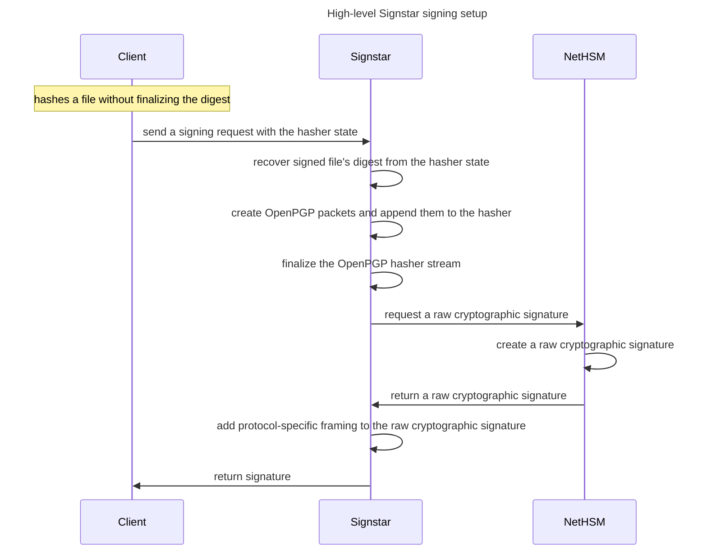
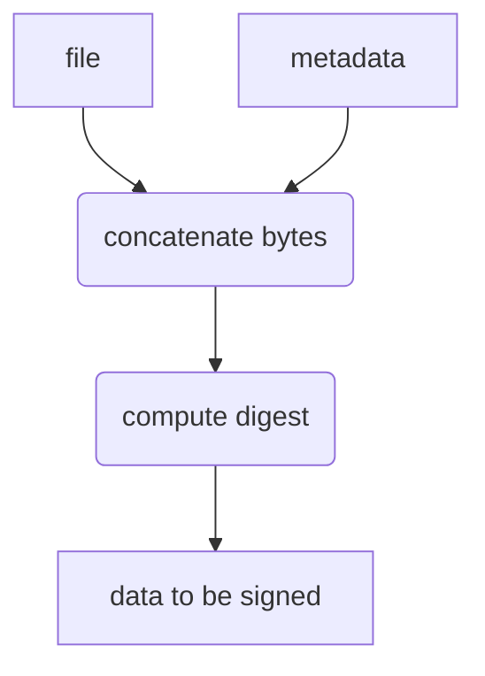
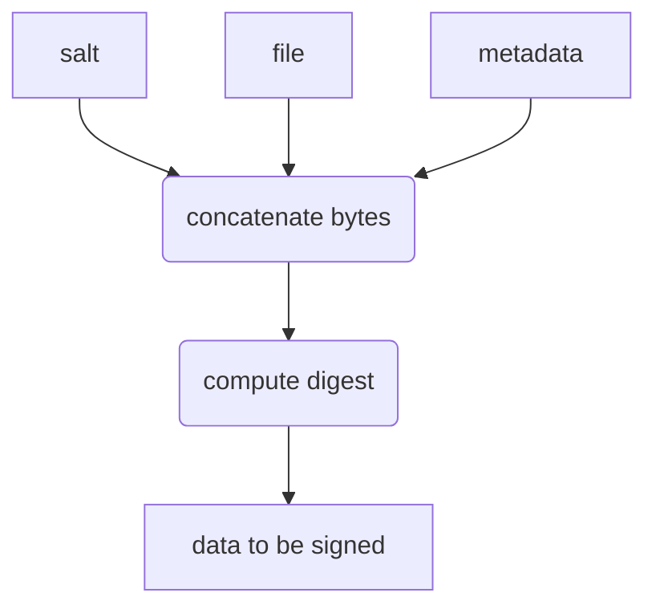
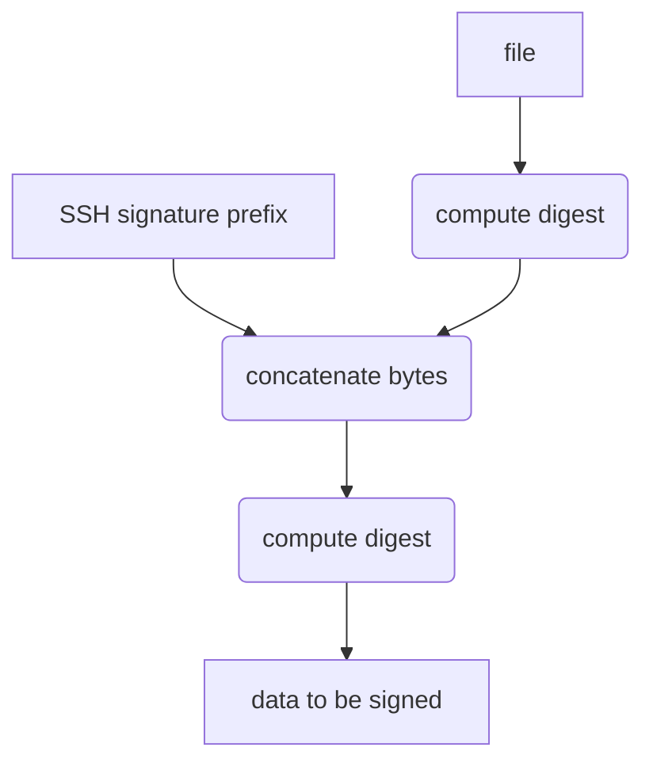
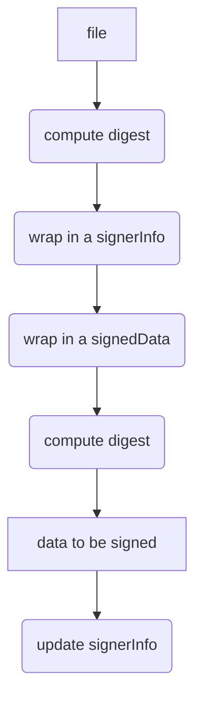

# Design

This document describes the design decisions and technical details of the signature request mechanism used by Signstar.

## Design requirements

- the signing request must be of small size, regardless of the size of the signed file.
  This makes it possible to minimize network traffic between client and the signing server

- the signing request must convey enough information to identify the file being signed in a secure way

- the signing request must allow optional extensions and evolution of the format.
  Backwards and forwards compatibility will allow mixing versions of clients and servers which will make the migration to new versions smoother

- the format of the request must be easy to inspect by a human operator if such a need arises

## Transmitting the state instead of the digest

The signing requests of most cryptographic systems are based on providing a digest to create a signature for.
The Signstar project follows a different approach, outlined in the graph above.
The internal hasher state is transmitted instead of the final digest, which has several advantages:

- it decouples the act of hashing a file from the framing that is imposed by the target cryptographic system (e.g. [OpenPGP][9580]).

- transmitting the state makes it possible for the client to do just the file hashing with no cryptographic technology specific handling at all. All further cryptographic processing (e.g. appending OpenPGP packets) is done by the server.

- the server may append any packets that it sees fit, for example timestamping notations, capturing the identity of the signer or any constraints on the signature (such as making the signatures expire).

- since the state is just an array of bytes the signing server may additionally finalize it early to recover the digest of the file to be signed.

- the client cannot fake data (such as OpenPGP notations), since it is the server appending them.

- this design is easily expandable to other systems, that require only the file digest (such as SSH signatures).

The client sends a state and a malicious Signstar host could misuse the state to claim a signature over a different file.
This creates a central and exposed position for the signing service host and requires it to be trustworthy and sufficiently monitored.
In this design it is considered an acceptable trade-off, as the Signstar host is considered critical infrastructure, that has no direct access to private key material.

A discussion with the RustCrypto upstream raised the point that transmitting the state is ["well beyond the typical analysis"][SA], as hazmat functionality is made use of.
Note that transmitting the hasher state is only needed in the context of OpenPGP signatures, as in the case of SSH and X.509 the file digest is used directly.

[SA]: https://github.com/RustCrypto/traits/pull/1369#issuecomment-1858853105

## Comparison of signing methods

The following section discusses the details on what exactly is signed by the low-level cryptographic primitive.
All reviewed cryptographic systems allow attaching additional metadata to signed files.
Low-level primitives therefore make use of a different digest than that of the plain file itself.

### OpenPGP

In OpenPGP the calculation of the digest-to-be-signed is described in [RFC 9580: Notes on Signatures][NOS].

Currently, two types of signatures are in active use: Version 4 and version 6.

For version 4 signatures a hash of the file to be signed is created.
Then the hasher is updated with OpenPGP specific metadata (signature subpackets), just as if they were appended at the end of the file.

This can be imagined as follows:

[RFC 9580][9580], which is a revision of the widely implemented [RFC 4880][4880] additionally specifies [Version 6 signatures][SIGS] which prepend the file with a randomly [generated "salt" value][SV]:

[9580]: https://www.rfc-editor.org/rfc/rfc9580
[4880]: https://www.rfc-editor.org/rfc/rfc4880
[SIGS]: https://www.rfc-editor.org/rfc/rfc9580#section-5.2.3
[NOS]: https://www.rfc-editor.org/rfc/rfc9580#section-5.2.3.6
[SV]: https://www.rfc-editor.org/rfc/rfc9580#name-advantages-of-salted-signat

The server creates `pgp-metadata` and continues the hashing, which produces the final `digest-to-be-signed`.

With V4 signatures the server is able to recover the digest of the file, which may be embedded in the OpenPGP metadata as a [signature notation][notation data].

Version 6 signatures prepend a randomly generated "salt" value, which precludes calculation of the original file digest by the server and addition of this value as a  [signature notation][notation data].
However, this still allows to issue a signature over the combination of salt and file.

[notation data]: https://www.rfc-editor.org/rfc/rfc9580#name-notation-data

### SSH file signatures

SSH calculates the file digest directly, then wraps that digest's value in a different structure, which includes metadata.

The documentation provides a [rationale][SR] to why the file digest is computed first:

> This is done to limit the amount of data presented to the signature operation, which may be of concern if the signing key is held in limited or slow hardware or on a remote ssh-agent.

[SR]: https://github.com/openssh/openssh-portable/blob/ef7c26cd2f0f9a8222f851d1e551f6dfd3113f8b/PROTOCOL.sshsig#L64

Conceptually the operation looks like this:

### X.509 signatures

X.509 signatures are similar to SSH file signatures: the digest of the file is computed first, then it is embedded in the [`SignedData` structure][SDS] through an intermediate [`SignerInfo` structure][SIS]. The entire `SignedData` structure is digested and signed. The signature is inserted as a field of the `SignerInfo`.

[SDS]: https://www.rfc-editor.org/rfc/rfc5652#section-5.1
[SIS]: https://www.rfc-editor.org/rfc/rfc5652#section-5.3

